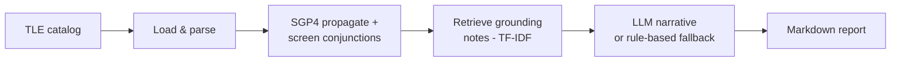

# 🛰️ Orbital Collision-Risk Agent

[](https://github.com/likhitha281/orbital-collision-risk-agent/actions/workflows/ci.yml)


**🔴 [Live dashboard](https://likhitha281.github.io/orbital-collision-risk-agent/)** — no login, no setup, updates automatically every 4 hours.

This project has two parts, and they do different jobs:

- **Phase 1 — `run_baseline.py`**: an SGP4-from-scratch physics baseline.
  Ingests TLEs, propagates orbits, screens for close approaches, computes a
  research-grounded probability of collision (2D-Pc, Foster & Estes 1992).
  Demonstrates understanding of the underlying orbital mechanics.
- **Phase 2 — `run_triage.py`**: the actual accessible-triage product.
  Doesn't reimplement screening — pulls real, published conjunction data
  from [CelesTrak's SOCRATES Plus](https://celestrak.org/SOCRATES/) (real
  Pc, real covariance, computed with professional STK/CAT tooling) and adds
  the one thing that data doesn't already have: a prioritized, explained,
  plain-language triage layer for anyone without a dedicated SSA analyst on
  staff. See [`docs/RESEARCH.md`](docs/RESEARCH.md) for exactly why this
  split exists and what real prior art (SOCRATES, and the open-source
  SIMPLETON screener) this project deliberately does not try to replace.

📄 [`docs/RESEARCH.md`](docs/RESEARCH.md) has the actual papers, data
sources, and an honest account of where each phase simplifies relative to
production space-situational-awareness systems.

## Why this problem

Low Earth orbit is getting crowded — tens of thousands of tracked objects,
with close approaches ("conjunctions") between satellites and debris
happening constantly. Real operators triage these using automated screening
tools plus human judgment. This project is a small, honest slice of that
pipeline: real orbital mechanics, a real (if coarse) screening algorithm, and
an agent that explains *why* something is or isn't a concern instead of just
printing a number.

## Architecture



Full breakdown, including design rationale and known limitations, in
[`docs/architecture.md`](docs/architecture.md).

## Quickstart

```bash
git clone https://github.com/likhitha281/orbital-collision-risk-agent.git
cd orbital-collision-risk-agent
pip install -r requirements.txt

python run_baseline.py --input data/sample_catalog.tle --output report.md
```

Optional — for LLM-generated narrative recommendations instead of the
rule-based fallback:

```bash
export ANTHROPIC_API_KEY=sk-ant-...
python run_baseline.py --input data/sample_catalog.tle --output report.md
```

Run the test suite:

```bash
python -m pytest tests/ -v
```

## Phase 2: real-data triage

```bash
python run_triage.py --max-results 50 --min-probability 1e-6 --output triage_report.md
```

This fetches real conjunction data from CelesTrak SOCRATES Plus (see
`src/socrates_client.py` — respects their usage policy with a 10-hour
minimum re-fetch cache, matching SOCRATES's own update cadence), filters
and prioritizes by real probability of collision, and runs the same
knowledge-base + narrative layer as phase 1. Every report explicitly labels
whether Pc is real (`socrates_real`) or this project's own assumed-covariance
estimate (`assumed_covariance`) — see [`examples/sample_triage_report.md`](examples/sample_triage_report.md)
for a worked example (generated with mocked data matching the real schema,
since this can't reach the network from every environment — run it yourself
for a live report).

**One thing to verify before relying on this**: `src/socrates_client.py`
assumes SOCRATES Plus's CSV export accepts a `FORMAT=CSV` parameter,
following the convention CelesTrak uses elsewhere — this project's sandbox
couldn't confirm that URL directly (see the module docstring). Open the
built URL in a browser once and adjust if needed; the CSV column parsing
itself is taken verbatim from CelesTrak's documented format and is correct
regardless.

## Sample output

The bundled sample catalog (`data/sample_catalog.tle`) contains the real,
current ISS (ZARYA) TLE plus one synthetic object seeded with a mean anomaly
close enough to guarantee a detectable close approach — this gives the
pipeline a concrete, reproducible test case without depending on live
tracking data lining up with a real conjunction at run time.

```
[1/4] Loading TLE catalog from data/sample_catalog.tle ...
      Loaded 2 object(s): ['ISS (ZARYA)', 'TEST-DEBRIS-1 (SYNTHETIC)']
[2/4] Screening for conjunctions over 6000s window ...
      Flagged 1 conjunction(s) under 25.0 km
[3/4] Retrieving grounding notes and generating risk assessments ...
[4/4] Writing report to report.md ...
```

Full report: [`examples/sample_report.md`](examples/sample_report.md).

| Object A | Object B | Miss distance | Pc (2D-Pc, assumed covariance) | Risk tier |
|---|---|---|---|---|
| ISS (ZARYA) | TEST-DEBRIS-1 (synthetic) | 2.77 km | 7.8e-22 | MEDIUM |

## Running it "live"

`--live` fetches the current catalog from Celestrak instead of using a static
file:

```bash
python run_baseline.py --live --live-group stations --output report.md
```

**On cadence**: Celestrak's own data is refreshed roughly every 2 hours, and
they ask users not to poll more often than that — `live_fetch.py` enforces
this with a local cache, so re-running the command more frequently just
serves the cached copy instead of hammering their servers. This is a
meaningful constraint, not a corner cut: no free public tracking data source
updates faster than that, so "real-time" here genuinely means "always
within one refresh cycle of current."

**Keeping it running automatically**: `.github/workflows/live-monitor.yml`
runs on that same 4-hour cadence via GitHub Actions, fetches live data,
regenerates the report, and commits it to `reports/latest.md` — so the repo
itself stays continuously up to date without you doing anything. Trigger it
manually anytime from the repo's Actions tab, or just let the schedule run.
Add an `ANTHROPIC_API_KEY` repository secret to get LLM-generated narratives
in the scheduled runs (optional — falls back to the rule-based writer
without it).

**Scaling note**: screening is O(n²) in catalog size, so `--live-group
stations` (a few dozen objects) runs fast; `--live-group active` (thousands
of objects) will be very slow without the spatial-partitioning improvement
noted in Limitations. Start small.

## Live dashboard setup (one-time, ~2 minutes)

The dashboard at `docs/index.html` is a static page — no server, no build
step — that reads `docs/latest.json`. To make it public:

1. Push this repo to GitHub (see below if you haven't yet).
2. Repo **Settings → Pages** → under "Build and deployment", set **Source**
   to "Deploy from a branch", branch `main`, folder `/docs` → **Save**.
3. GitHub gives you a URL like
   `https://likhitha281.github.io/orbital-collision-risk-agent/` within a
   minute or two. That's the link for a resume or a recruiter — no login,
   no setup on their end.

The page ships with `docs/latest.json` seeded from the sample run, so it
works immediately; `live-monitor.yml` (above) then keeps it updated
automatically every 4 hours by committing a fresh `docs/latest.json` — GitHub
Pages just serves whatever's currently in `docs/` on `main`, so no manual
redeploy step is needed.

## Docker & other orchestration options

The pipeline itself doesn't change — these are different ways to package
and schedule the same `run_baseline.py` logic, depending on where you want
it to run.

### Docker

Containerizing decouples the pipeline from any specific runner (GitHub
Actions, your laptop, a cloud VM) — build once, run identically anywhere
Docker runs:

```bash
docker build -t orbital-collision-agent .
docker run --rm -v $(pwd)/output:/app/output orbital-collision-agent
# live mode:
docker run --rm -v $(pwd)/output:/app/output -e ANTHROPIC_API_KEY \
    orbital-collision-agent --live --live-group stations --output /app/output/report.md
```

Or via `docker-compose.yml`:

```bash
docker compose run --rm baseline   # static sample
docker compose run --rm live       # live Celestrak fetch
```

### Scheduling options compared

| Approach | Where it runs | Setup cost | When it's worth it |
|---|---|---|---|
| **GitHub Actions cron** (what this repo uses — `.github/workflows/live-monitor.yml`) | GitHub's runners | Already done | Default choice at this project's scale: one data source, one job, no dependencies between tasks |
| **Docker + Ofelia** (`docker-compose.yml`, `scheduled` profile) | Any host you control | `docker compose --profile scheduled up -d` | You want scheduling off GitHub's infrastructure entirely, e.g. a home server or VPS |
| **Kubernetes CronJob** (`k8s/cronjob.yaml`) | A k8s cluster | Requires a cluster + image registry | This pipeline needs to run alongside other infrastructure you already operate on k8s |
| **Prefect** (`orchestration/prefect_flow.py`) | Prefect server/Cloud + your compute | `pip install prefect` + a deployment | The pipeline grows: multiple data sources, tasks that depend on each other, need for per-task retries, backfills, or a UI showing exactly which step failed |

**Honest take**: for what this project does today — one fetch, one screen,
one report, every 4 hours — the GitHub Actions cron job is genuinely the
right amount of infrastructure, not a placeholder waiting to be replaced.
Docker and Prefect are here to show the next step and make the tradeoff
concrete, not because the current pipeline needs them. Reaching for Airflow
or Kubernetes for a single scheduled script is a common over-engineering
mistake — the honest engineering signal is knowing when *not* to add the
heavier tool, not defaulting to it.

## Project layout

```
orbital-collision-agent/
├── run_baseline.py          # CLI entrypoint / orchestrator
├── Dockerfile
├── docker-compose.yml
├── k8s/cronjob.yaml          # Kubernetes-native scheduling alternative
├── orchestration/
│   ├── prefect_flow.py       # same pipeline as an orchestrated flow
│   └── README.md
├── src/
│   ├── tle_loader.py               # tool: parse TLE files
│   ├── live_fetch.py               # tool: cached live pull from Celestrak
│   ├── conjunction.py              # tool: SGP4 propagation + screening
│   ├── probability_of_collision.py # tool: 2D-Pc (Foster & Estes, 1992)
│   ├── socrates_client.py          # tool: real conjunction data (CelesTrak SOCRATES Plus)
│   ├── triage.py                   # phase 2: adapts real data into the pipeline
│   ├── knowledge_base.py           # tool: TF-IDF retrieval (RAG-lite)
│   ├── reasoning_agent.py          # tool: LLM narrative + rule-based fallback
│   └── report.py                   # formats final Markdown/JSON report (provenance-aware)
├── run_baseline.py          # phase 1 entrypoint (SGP4 physics baseline)
├── run_triage.py            # phase 2 entrypoint (real-data triage layer)
├── data/sample_catalog.tle  # real ISS TLE + synthetic test object
├── examples/
│   ├── sample_report.md          # phase 1 example output
│   └── sample_triage_report.md   # phase 2 example output
├── reports/                 # auto-populated by the live-monitor workflow
├── tests/
├── docs/
│   ├── index.html           # static live dashboard (GitHub Pages)
│   ├── latest.json          # data the dashboard reads (auto-updated)
│   ├── architecture.md
│   └── RESEARCH.md          # real papers/data sources this is built on
└── .github/workflows/
    ├── ci.yml                # tests on every push
    └── live-monitor.yml      # scheduled live fetch + report refresh
```

## What's next (honest, unfinished list)

- **Dashboard doesn't show phase 2 yet** — `docs/index.html` currently
  reads phase 1's `latest.json`. Wiring `run_triage.py` into
  `live-monitor.yml` and giving the dashboard a phase 1/phase 2 toggle is
  the natural next step, not yet done.
- **Screening accuracy**: phase 1's fixed-grid sampling vs. adaptive
  root-finding for the true minimum — phase 2 sidesteps this by using
  SOCRATES's real numbers instead, but phase 1 still has this gap.
- **Recommendation quality**: LLM narrative vs. rule-based template,
  ideally rated by human preference on concreteness and operational
  relevance — not yet measured, just asserted.
- **Scale**: phase 1's O(n²) screening won't reach full-catalog size; phase
  2 doesn't have this problem since SOCRATES already screens the full
  catalog.

## Limitations and next steps

- Fixed-grid time sampling (phase 1) can miss the true closest approach
  between samples — next step is adaptive/root-finding refinement near
  flagged windows.
- O(n²) pairwise screening (phase 1) won't scale to full real-world catalogs
  (~30,000+ tracked objects) without spatial partitioning — phase 2 avoids
  this entirely by consuming SOCRATES's already-full-catalog results.
- The knowledge base is six hand-written notes, not a real corpus of
  operator handbooks — a real version would need licensed or public
  domain source documents and a proper vector index.
- Phase 1's Pc uses an **assumed, generic covariance** (see
  [`docs/RESEARCH.md`](docs/RESEARCH.md)) because TLEs don't carry real
  tracking-derived uncertainty. Phase 2's Pc is real (SOCRATES Plus), but
  this project doesn't independently verify CelesTrak's numbers — it trusts
  and clearly attributes them.
- `src/socrates_client.py`'s exact CSV endpoint parameter is unverified
  from this sandbox (see the module docstring) — a one-time manual check
  needed before relying on it.

## Research & References

The methods here aren't invented for this project — see
[`docs/RESEARCH.md`](docs/RESEARCH.md) for the actual papers (Foster &
Estes 1992 on the 2D-Pc method, Vallado et al. on SGP4, Kessler & Cour-Palais
1978 on why debris risk compounds) and standards (CCSDS Conjunction Data
Message format) this implementation draws on, plus an honest comparison
against what production space-situational-awareness systems do differently.

## Scope and honesty about "production use"

Phase 1 is a capstone-grade physics baseline, not a production SSA
product — real conjunction assessment is a capital-intensive field with
entrenched, well-funded providers (NASA CARA, the 18th Space Defense
Squadron, LeoLabs, Slingshot Aerospace, COMSPOC) who have access to
tracking data and covariance this project doesn't, and CelesTrak's free
SOCRATES Plus service already does full-catalog screening better than
phase 1 does or reasonably could.

Phase 2 makes a narrower, more defensible claim: it's an accessibility
layer on top of SOCRATES's real, trusted data, aimed at operators and
students without a dedicated SSA analyst — not a replacement for
professional conjunction assessment, and every report says so explicitly
(real vs. assumed Pc, staleness flags, "drafting aid, not decision-maker"
framing throughout). See [`docs/RESEARCH.md`](docs/RESEARCH.md) for the
full reasoning behind that positioning, including the open-source prior
art (SIMPLETON) that shaped it.

## License

MIT — see [`LICENSE`](LICENSE).
