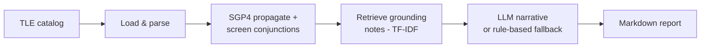

# 🛰️ Orbital Collision-Risk Agent

[](https://github.com/YOUR_USERNAME/orbital-collision-agent/actions/workflows/ci.yml)


A multi-tool agentic system that ingests real satellite orbital data (TLEs),
propagates orbits with SGP4, screens for close approaches between objects,
retrieves relevant space-traffic-management practice, and produces a
grounded, human-readable collision-risk report — with an LLM-generated
narrative that falls back to a deterministic rule-based writer when no API
key is available.

Built as a capstone baseline for CSE598 (Agentic AI Systems). This is
**phase 1**: a small, runnable, reproducible baseline. The evaluation and
scaling plan for phase 2 is in [`docs/architecture.md`](docs/architecture.md)
and the proposal writeup.

## Why this problem

Low Earth orbit is getting crowded — tens of thousands of tracked objects,
with close approaches ("conjunctions") between satellites and debris
happening constantly. Real operators triage these using automated screening
tools plus human judgment. This project is a small, honest slice of that
pipeline: real orbital mechanics, a real (if coarse) screening algorithm, and
an agent that explains *why* something is or isn't a concern instead of just
printing a number.

## Architecture



Full breakdown, including design rationale and known limitations, in
[`docs/architecture.md`](docs/architecture.md).

## Quickstart

```bash
git clone https://github.com/YOUR_USERNAME/orbital-collision-agent.git
cd orbital-collision-agent
pip install -r requirements.txt

python run_baseline.py --input data/sample_catalog.tle --output report.md
```

Optional — for LLM-generated narrative recommendations instead of the
rule-based fallback:

```bash
export ANTHROPIC_API_KEY=sk-ant-...
python run_baseline.py --input data/sample_catalog.tle --output report.md
```

Run the test suite:

```bash
python -m pytest tests/ -v
```

## Sample output

The bundled sample catalog (`data/sample_catalog.tle`) contains the real,
current ISS (ZARYA) TLE plus one synthetic object seeded with a mean anomaly
close enough to guarantee a detectable close approach — this gives the
pipeline a concrete, reproducible test case without depending on live
tracking data lining up with a real conjunction at run time.

```
[1/4] Loading TLE catalog from data/sample_catalog.tle ...
      Loaded 2 object(s): ['ISS (ZARYA)', 'TEST-DEBRIS-1 (SYNTHETIC)']
[2/4] Screening for conjunctions over 6000s window ...
      Flagged 1 conjunction(s) under 25.0 km
[3/4] Retrieving grounding notes and generating risk assessments ...
[4/4] Writing report to report.md ...
```

Full report: [`examples/sample_report.md`](examples/sample_report.md).

| Object A | Object B | Miss distance | Risk tier |
|---|---|---|---|
| ISS (ZARYA) | TEST-DEBRIS-1 (synthetic) | 2.77 km | MEDIUM |

## Using real catalog data

Any standard 3-line TLE file works as input — e.g. current catalogs from
[Celestrak](https://celestrak.org/NORAD/elements/). Download a group (e.g.
active satellites) to a `.tle` file and point `--input` at it:

```bash
python run_baseline.py --input path/to/downloaded_catalog.tle --output report.md
```

Note: screening is currently O(n²) in the number of objects, so start with a
few dozen to a few hundred objects rather than the full multi-thousand-object
catalog (see [Limitations](#limitations-and-next-steps)).

## Project layout

```
orbital-collision-agent/
├── run_baseline.py          # CLI entrypoint / orchestrator
├── src/
│   ├── tle_loader.py        # tool: parse TLE files
│   ├── conjunction.py       # tool: SGP4 propagation + screening
│   ├── knowledge_base.py    # tool: TF-IDF retrieval (RAG-lite)
│   ├── reasoning_agent.py   # tool: LLM narrative + rule-based fallback
│   └── report.py            # formats final Markdown report
├── data/sample_catalog.tle  # real ISS TLE + synthetic test object
├── examples/sample_report.md
├── tests/test_conjunction.py
└── docs/architecture.md
```

## Evaluation plan (for the improved system)

The baseline's coarse, fixed-grid screening and rule-based fallback are the
things future iterations should beat. Planned comparisons:

- **Screening accuracy**: fixed-grid sampling vs. adaptive root-finding for
  true minimum distance, validated against known historical conjunction
  events.
- **Recommendation quality**: LLM narrative vs. rule-based template, rated by
  human preference / LLM-as-judge on concreteness and operational relevance.
- **Latency & cost**: end-to-end run time and API cost per catalog size.
- **Scale**: current O(n²) screening vs. a spatially-partitioned approach, as
  catalog size grows from dozens to thousands of objects.

## Limitations and next steps

- Fixed-grid time sampling can miss the true closest approach between
  samples — next step is adaptive/root-finding refinement near flagged
  windows.
- O(n²) pairwise screening won't scale to full real-world catalogs
  (~30,000+ tracked objects) without spatial partitioning (e.g. orbit-shell
  bucketing) to cut down candidate pairs first.
- The knowledge base is five hand-written notes, not a real corpus of
  operator handbooks — a real version would need licensed or public
  domain source documents and a proper vector index.
- No probability-of-collision (Pc) computation yet — miss distance alone is
  a coarse proxy; a real system would fold in covariance/uncertainty.

## License

MIT — see [`LICENSE`](LICENSE).
