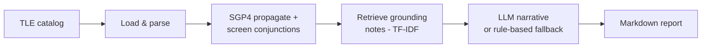

# 🛰️ Orbital Collision-Risk Agent

[](https://github.com/likhitha281/orbital-collision-risk-agent/actions/workflows/ci.yml)


**🔴 [Live dashboard](https://likhitha281.github.io/orbital-collision-risk-agent/)** — no login, no setup, updates automatically every 4 hours.


A multi-tool agentic system that ingests real satellite orbital data (TLEs),
propagates orbits with SGP4, screens for close approaches between objects,
computes a research-grounded probability of collision (the 2D-Pc method,
Foster & Estes 1992), retrieves relevant space-traffic-management practice,
and produces a grounded, human-readable collision-risk report — with an
LLM-generated narrative that falls back to a deterministic rule-based writer
when no API key is available.

📄 See [`docs/RESEARCH.md`](docs/RESEARCH.md) for the actual papers and
standards this implementation is based on, and an honest account of where it
simplifies relative to production space-situational-awareness systems.

Built as a capstone baseline for CSE598 (Agentic AI Systems). This is
**phase 1**: a small, runnable, reproducible baseline. The evaluation and
scaling plan for phase 2 is in [`docs/architecture.md`](docs/architecture.md)
and the proposal writeup.

## Why this problem

Low Earth orbit is getting crowded — tens of thousands of tracked objects,
with close approaches ("conjunctions") between satellites and debris
happening constantly. Real operators triage these using automated screening
tools plus human judgment. This project is a small, honest slice of that
pipeline: real orbital mechanics, a real (if coarse) screening algorithm, and
an agent that explains *why* something is or isn't a concern instead of just
printing a number.

## Architecture



Full breakdown, including design rationale and known limitations, in
[`docs/architecture.md`](docs/architecture.md).

## Quickstart

```bash
git clone https://github.com/likhitha281/orbital-collision-risk-agent.git
cd orbital-collision-risk-agent
pip install -r requirements.txt

python run_baseline.py --input data/sample_catalog.tle --output report.md
```

Optional — for LLM-generated narrative recommendations instead of the
rule-based fallback:

```bash
export ANTHROPIC_API_KEY=sk-ant-...
python run_baseline.py --input data/sample_catalog.tle --output report.md
```

Run the test suite:

```bash
python -m pytest tests/ -v
```

## Sample output

The bundled sample catalog (`data/sample_catalog.tle`) contains the real,
current ISS (ZARYA) TLE plus one synthetic object seeded with a mean anomaly
close enough to guarantee a detectable close approach — this gives the
pipeline a concrete, reproducible test case without depending on live
tracking data lining up with a real conjunction at run time.

```
[1/4] Loading TLE catalog from data/sample_catalog.tle ...
      Loaded 2 object(s): ['ISS (ZARYA)', 'TEST-DEBRIS-1 (SYNTHETIC)']
[2/4] Screening for conjunctions over 6000s window ...
      Flagged 1 conjunction(s) under 25.0 km
[3/4] Retrieving grounding notes and generating risk assessments ...
[4/4] Writing report to report.md ...
```

Full report: [`examples/sample_report.md`](examples/sample_report.md).

| Object A | Object B | Miss distance | Pc (2D-Pc, assumed covariance) | Risk tier |
|---|---|---|---|---|
| ISS (ZARYA) | TEST-DEBRIS-1 (synthetic) | 2.77 km | 7.8e-22 | MEDIUM |

## Running it "live"

`--live` fetches the current catalog from Celestrak instead of using a static
file:

```bash
python run_baseline.py --live --live-group stations --output report.md
```

**On cadence**: Celestrak's own data is refreshed roughly every 2 hours, and
they ask users not to poll more often than that — `live_fetch.py` enforces
this with a local cache, so re-running the command more frequently just
serves the cached copy instead of hammering their servers. This is a
meaningful constraint, not a corner cut: no free public tracking data source
updates faster than that, so "real-time" here genuinely means "always
within one refresh cycle of current."

**Keeping it running automatically**: `.github/workflows/live-monitor.yml`
runs on that same 4-hour cadence via GitHub Actions, fetches live data,
regenerates the report, and commits it to `reports/latest.md` — so the repo
itself stays continuously up to date without you doing anything. Trigger it
manually anytime from the repo's Actions tab, or just let the schedule run.
Add an `ANTHROPIC_API_KEY` repository secret to get LLM-generated narratives
in the scheduled runs (optional — falls back to the rule-based writer
without it).

**Scaling note**: screening is O(n²) in catalog size, so `--live-group
stations` (a few dozen objects) runs fast; `--live-group active` (thousands
of objects) will be very slow without the spatial-partitioning improvement
noted in Limitations. Start small.

## Live dashboard setup (one-time, ~2 minutes)

The dashboard at `docs/index.html` is a static page — no server, no build
step — that reads `docs/latest.json`. To make it public:

1. Push this repo to GitHub (see below if you haven't yet).
2. Repo **Settings → Pages** → under "Build and deployment", set **Source**
   to "Deploy from a branch", branch `main`, folder `/docs` → **Save**.
3. GitHub gives you a URL like
   `https://likhitha281.github.io/orbital-collision-risk-agent/` within a
   minute or two. That's the link for a resume or a recruiter — no login,
   no setup on their end.

The page ships with `docs/latest.json` seeded from the sample run, so it
works immediately; `live-monitor.yml` (above) then keeps it updated
automatically every 4 hours by committing a fresh `docs/latest.json` — GitHub
Pages just serves whatever's currently in `docs/` on `main`, so no manual
redeploy step is needed.

## Docker & other orchestration options

The pipeline itself doesn't change — these are different ways to package
and schedule the same `run_baseline.py` logic, depending on where you want
it to run.

### Docker

Containerizing decouples the pipeline from any specific runner (GitHub
Actions, your laptop, a cloud VM) — build once, run identically anywhere
Docker runs:

```bash
docker build -t orbital-collision-agent .
docker run --rm -v $(pwd)/output:/app/output orbital-collision-agent
# live mode:
docker run --rm -v $(pwd)/output:/app/output -e ANTHROPIC_API_KEY \
    orbital-collision-agent --live --live-group stations --output /app/output/report.md
```

Or via `docker-compose.yml`:

```bash
docker compose run --rm baseline   # static sample
docker compose run --rm live       # live Celestrak fetch
```

### Scheduling options compared

| Approach | Where it runs | Setup cost | When it's worth it |
|---|---|---|---|
| **GitHub Actions cron** (what this repo uses — `.github/workflows/live-monitor.yml`) | GitHub's runners | Already done | Default choice at this project's scale: one data source, one job, no dependencies between tasks |
| **Docker + Ofelia** (`docker-compose.yml`, `scheduled` profile) | Any host you control | `docker compose --profile scheduled up -d` | You want scheduling off GitHub's infrastructure entirely, e.g. a home server or VPS |
| **Kubernetes CronJob** (`k8s/cronjob.yaml`) | A k8s cluster | Requires a cluster + image registry | This pipeline needs to run alongside other infrastructure you already operate on k8s |
| **Prefect** (`orchestration/prefect_flow.py`) | Prefect server/Cloud + your compute | `pip install prefect` + a deployment | The pipeline grows: multiple data sources, tasks that depend on each other, need for per-task retries, backfills, or a UI showing exactly which step failed |

**Honest take**: for what this project does today — one fetch, one screen,
one report, every 4 hours — the GitHub Actions cron job is genuinely the
right amount of infrastructure, not a placeholder waiting to be replaced.
Docker and Prefect are here to show the next step and make the tradeoff
concrete, not because the current pipeline needs them. Reaching for Airflow
or Kubernetes for a single scheduled script is a common over-engineering
mistake — the honest engineering signal is knowing when *not* to add the
heavier tool, not defaulting to it.

## Project layout

```
orbital-collision-agent/
├── run_baseline.py          # CLI entrypoint / orchestrator
├── Dockerfile
├── docker-compose.yml
├── k8s/cronjob.yaml          # Kubernetes-native scheduling alternative
├── orchestration/
│   ├── prefect_flow.py       # same pipeline as an orchestrated flow
│   └── README.md
├── src/
│   ├── tle_loader.py               # tool: parse TLE files
│   ├── live_fetch.py               # tool: cached live pull from Celestrak
│   ├── conjunction.py              # tool: SGP4 propagation + screening
│   ├── probability_of_collision.py # tool: 2D-Pc (Foster & Estes, 1992)
│   ├── knowledge_base.py           # tool: TF-IDF retrieval (RAG-lite)
│   ├── reasoning_agent.py          # tool: LLM narrative + rule-based fallback
│   └── report.py                   # formats final Markdown report
├── data/sample_catalog.tle  # real ISS TLE + synthetic test object
├── examples/sample_report.md
├── reports/                 # auto-populated by the live-monitor workflow
├── tests/
├── docs/
│   ├── index.html           # static live dashboard (GitHub Pages)
│   ├── latest.json          # data the dashboard reads (auto-updated)
│   ├── architecture.md
│   └── RESEARCH.md          # real papers/standards this is built on
└── .github/workflows/
    ├── ci.yml                # tests on every push
    └── live-monitor.yml      # scheduled live fetch + report refresh
```

## Evaluation plan (for the improved system)

The baseline's coarse, fixed-grid screening and rule-based fallback are the
things future iterations should beat. Planned comparisons:

- **Screening accuracy**: fixed-grid sampling vs. adaptive root-finding for
  true minimum distance, validated against known historical conjunction
  events.
- **Recommendation quality**: LLM narrative vs. rule-based template, rated by
  human preference / LLM-as-judge on concreteness and operational relevance.
- **Latency & cost**: end-to-end run time and API cost per catalog size.
- **Scale**: current O(n²) screening vs. a spatially-partitioned approach, as
  catalog size grows from dozens to thousands of objects.

## Limitations and next steps

- Fixed-grid time sampling can miss the true closest approach between
  samples — next step is adaptive/root-finding refinement near flagged
  windows.
- O(n²) pairwise screening won't scale to full real-world catalogs
  (~30,000+ tracked objects) without spatial partitioning (e.g. orbit-shell
  bucketing) to cut down candidate pairs first.
- The knowledge base is five hand-written notes, not a real corpus of
  operator handbooks — a real version would need licensed or public
  domain source documents and a proper vector index.
- Pc uses an **assumed, generic covariance** (see
  [`docs/RESEARCH.md`](docs/RESEARCH.md)) because TLEs don't carry real
  tracking-derived uncertainty — the method is correctly implemented, but
  the number itself isn't operational-grade.

## Research & References

The methods here aren't invented for this project — see
[`docs/RESEARCH.md`](docs/RESEARCH.md) for the actual papers (Foster &
Estes 1992 on the 2D-Pc method, Vallado et al. on SGP4, Kessler & Cour-Palais
1978 on why debris risk compounds) and standards (CCSDS Conjunction Data
Message format) this implementation draws on, plus an honest comparison
against what production space-situational-awareness systems do differently.

## Scope and honesty about "production use"

This is a capstone-grade baseline, not a production SSA product — real
conjunction assessment is a capital-intensive field with entrenched,
well-funded providers (NASA CARA, the 18th Space Defense Squadron, LeoLabs,
Slingshot Aerospace, COMSPOC) who have access to tracking data and
covariance this project doesn't. What's genuinely solid here: the orbital
mechanics are real (SGP4), the Pc method is the actual one used in the
field, and every simplification is disclosed rather than hidden. That's the
honest pitch for a portfolio project, and it's also what would need to
change first for anyone to take a "real product" claim seriously.

## License

MIT — see [`LICENSE`](LICENSE).
